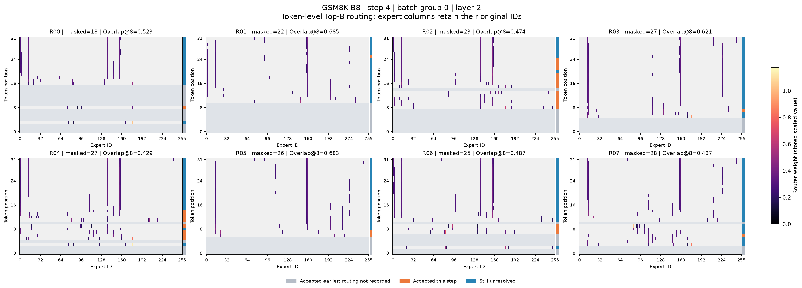
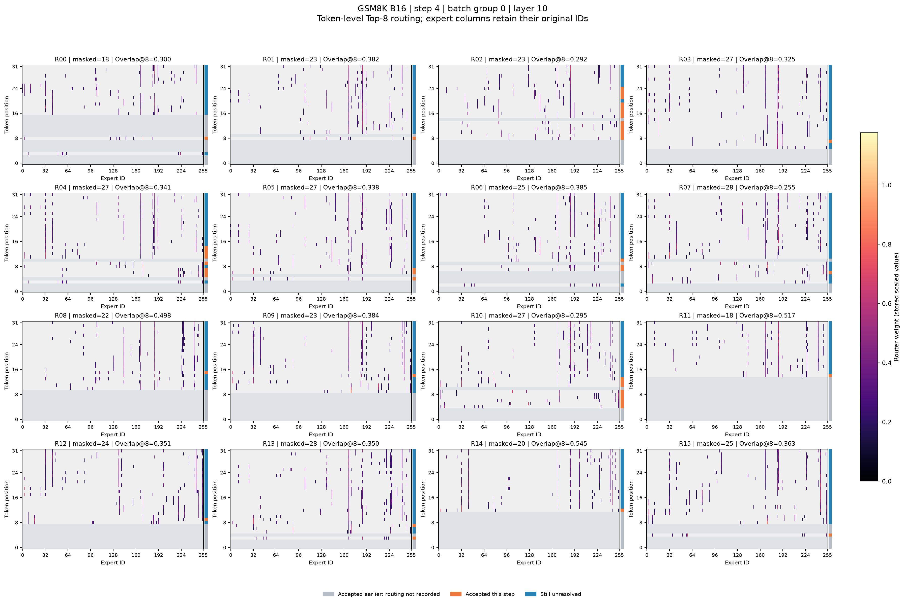
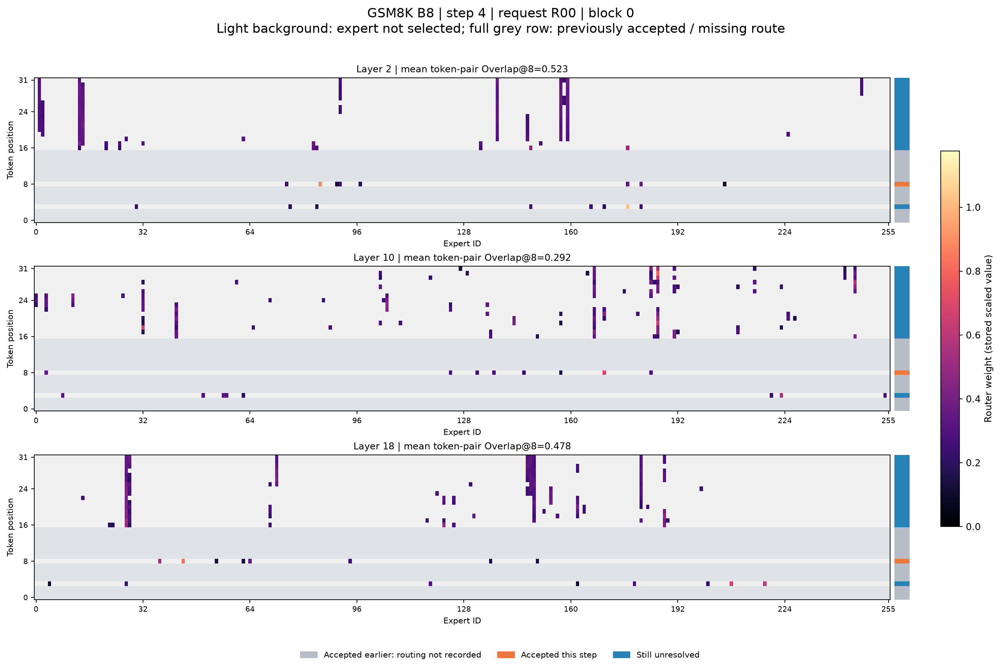
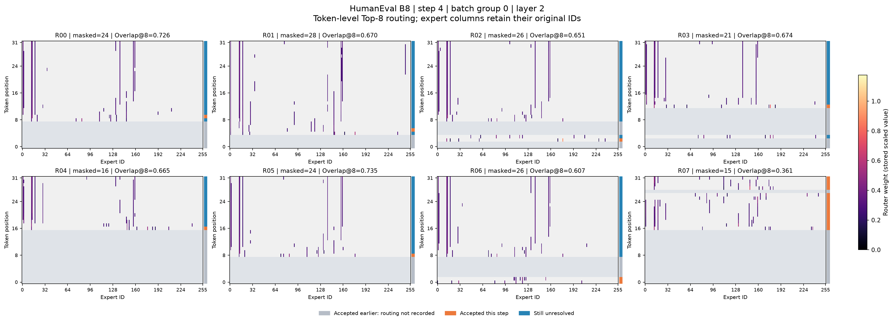

# LLaDA2.0-mini 单 block MoE 动机实验汇总

更新日期：2026-09-16。本文保留早期 GSM8K/HumanEval × batch 8/16 的四组负载直方图实验，并追加三组 token 级轨迹、跨层前沿及专家功能相似性实验。两个阶段是不同运行，不能混用 forward 次数或统计口径。

最新结论：GSM8K batch 8/16 和 HumanEval batch 8 均出现接受相关的深度曲线方向变化，但反转距离分别为 2|3、2|3、1|2，尚不是固定步数的“相变”。专家相似矩阵局部稳定、远距离漂移；当前静态最近专家替代误差没有随 step 增长。详见文末新增复核。

## 核心结果

- Batch 从 8 增至 16，两个任务的 active experts 都增加约 20，effective experts 仅增加约 2。支持此范围内有效工作集增长缓慢，尚不能确定严格饱和点。
- 相邻步完整排序的 Oracle 收益恢复率：GSM8K 97.36% → 98.42%，HumanEval 96.60% → 97.70%。
- 后续路由比第零步的等 assignment 数下采样更分散，同时负载排序仍高度可预测。不能表述为“越去噪越集中”。
- 证据范围是单个 32-token block 内未解析 mask Query 的路由，尚未证明多 block 稳定性或真实加速。
- 以下为早期负载统计阶段结论；单层执行 replay 与新增的专家功能相似性 replay 是不同实验，后者结果见文末。

## 实验设置与统计流程

| 配置 | 取值 |
|---|---|
| 模型 | LLaDA2.0-mini，256 experts，Top-8，记录 19 个 MoE 层 |
| 数据 | GSM8K / HumanEval，各配置 32 prompts |
| Batch | 8：4 groups；16：2 groups |
| Prompt | chat template 后过滤长度超过 128 的样本，并非截断 |
| 生成 | 1 个 32-token block，最多 32 次 denoising forward |
| 解码 | confidence > 0.95 或最低 transfer quota；temperature 0 |
| 执行 | HF Accelerate 双卡层切分，use_cache=False，未启用 FOCUS |
| 统计对象 | 当前生成 block 在 forward 开始时仍为 mask 的位置 |

每组在 prompt 后追加全 mask block。每一步完整执行模型主体，取得各层 Top-8 expert IDs，再筛选未解析位置，累计每层 256 维 assignment 直方图。LM head 对生成 block 计算候选 token，按置信度和最低接收量更新 mask，直至全部解析。

初始 Q=B×32，每层统计 assignment 数为 8Q。Q 下降代表统计对象减少；实际模型主体仍计算完整 prompt、padding 和整个生成 block。这些直方图并非 Vanilla 全部 MoE 工作量。双卡层切分也不是 Expert Parallel。

完整性检查通过：group 步号连续、相邻步剩余 Q 一致、末步 Q=0、每步 19 层、每层直方图之和为 Q×8。

| 配置 | 每组实际 forward 次数 |
|---|---|
| GSM8K batch 8 | 23、23、22、22 |
| GSM8K batch 16 | 25、22 |
| HumanEval batch 8 | 21、21、27、30 |
| HumanEval batch 16 | 24、30 |

## 四组路由对照

Active、effective、Top-10 share 为 step 0–12 均值；相邻 Jaccard 为目标 step 1–12 均值。区间内全部 groups 均存活，各 group、各层等权。该窗口仅用于描述性比较，相同步号不代表相同 Q 或生成进度。

Effective=(Σc)²/Σc²，表示集中程度，不能解释为可保留的实际专家个数。Top-10 share 是 assignment 占比，不是耗时或 router 权重占比。

| 数据集 | Batch | Active | Effective | Top-10 share | 相邻 Jaccard |
|---|---:|---:|---:|---:|---:|
| GSM8K | 8 | 98.64 | 33.16 | 47.18% | 79.14% |
| GSM8K | 16 | 118.88 | 35.21 | 45.78% | 83.48% |
| HumanEval | 8 | 94.86 | 37.07 | 44.89% | 74.62% |
| HumanEval | 16 | 115.18 | 39.31 | 43.71% | 78.29% |

GSM8K 的 active 增加 20.25、effective 增加 2.05；HumanEval 分别增加 20.31、2.24。支持有效工作集相对物理激活集合增长缓慢，而非固定的“30–40 个专家”定律：HumanEval batch 16 的 step 14 effective 约为 48.9。

HumanEval 从全 mask 初始化到第一次更新后的 Jaccard 仅约 53%–54%，随后较高；初始化转换值得单独分析，不宜把第零步专家表作为全程固定集合。

## 完整排序跨步预测

对当前步负载，分别按当前负载降序（Oracle）、先前步负载降序和随机排序期望计算累计覆盖曲线面积 AUC。收益恢复率=(AUC_previous−AUC_random)/(AUC_oracle−AUC_random)。并列负载按专家 ID 排序。

| 数据集 | Batch | lag 1 收益恢复率 | lag 8 收益恢复率 | lag 1 Oracle AUC | lag 1 Previous AUC |
|---|---:|---:|---:|---:|---:|
| GSM8K | 8 | 97.36% | 88.84% | 0.92565 | 0.91448 |
| GSM8K | 16 | 98.42% | 91.48% | 0.91841 | 0.91181 |
| HumanEval | 8 | 96.60% | 87.66% | 0.92317 | 0.90889 |
| HumanEval | 16 | 97.70% | 90.28% | 0.91638 | 0.90686 |

目标 step≤12；lag 8 只覆盖 step 8–12，不同 lag 并非完全相同目标样本上的比较。AUC 是负载覆盖指标，不是逐专家排名准确率或加速比。Oracle 对覆盖曲线最优，不保证对真实 kernel latency 最优。

结果支持复用上一步逐层排序作为执行准备的候选信号。仍需与固定逐层先验比较，区分长期专家偏好和额外时间连续性。

## Query-matched null

每个 group、每层固定 step-0 直方图，无放回抽取与目标步相同数量的 assignment，重复 256 次，seed=0。下表为 step 1–12 均值，区间与路由表不同。

| 数据集 | Batch | Active 真实 / Null | Effective 真实 / Null | Top-10 share 真实 / Null |
|---|---:|---:|---:|---:|
| GSM8K | 8 | 99.94 / 75.17 | 33.67 / 26.69 | 46.61% / 54.36% |
| GSM8K | 16 | 120.81 / 88.15 | 35.82 / 27.71 | 45.16% / 53.36% |
| HumanEval | 8 | 96.17 / 69.71 | 37.92 / 26.42 | 44.01% / 55.75% |
| HumanEval | 16 | 117.26 / 81.51 | 40.31 / 27.11 | 42.78% / 55.11% |

四组真实后续路由均比此基线更分散，支持“不能仅以第零步分布下采样解释后续变化”。这是 assignment-level 近似，未保持同一 token 的 Top-8 联合结构，不能声称排除了所有有限样本影响。其 95% 区间是条件抽样区间，不是跨数据集置信区间。

## 动机与证据边界

可支持的动机：两个任务、batch 8/16、单 block 内，未解析 Query 的专家负载非均匀且跨步可预测，有效工作集增长相对缓慢。候选方法是复用上一 step 的逐层负载顺序，准备专家调度或数据移动，保持当前 router 的全部 assignment。

尚未证明严格饱和、固定专家数、无损裁剪长尾、真实长文本任务质量、跨 block 稳定性、与 FOCUS 的互补加速或实际 latency 收益。Batch 16 仅两个 groups，层和相邻 step 并非独立样本。Trace 未记录 prompt ID/hash，不能仅凭直方图验证各配置请求完全相同或重建 token 路由。

尾部 group 完成后，仅对存活 group 汇总，平均 Q 可能回升，例如 HumanEval batch 16 step 23→24。这不表示同一 group 重新增加 mask。

## 下一步：单层专家 replay

本节保留早期执行性能实验计划；截至 2026-09-16，当前动机研究的优先事项已更新为文末的跨层现象控制分析。

四组轨迹和离线复核已完成；后续顺序为 replay → 多 block → Vanilla/FOCUS → 跨模型 → Expert Parallel。

先实现按真实直方图负载形状构造的合成单层 replay，明确使用的 MoE kernel 和模型专家矩阵尺寸。比较现有实现顺序、上一 step 顺序、当前负载降序；同一观测保持相同输入、权重、assignment 数和计算量。测量 kernel 时间、含重排/调度的总时间，加入 warm-up、重复测量和输出数值误差校验。

合成 replay 仅验证执行形状与顺序。真实 replay 需采集该层输入激活、Top-8 ID 和 router 权重。若评测 Vanilla 全部 MoE 工作量，还需包含 prompt 和已解析 token；mask-only trace 不足以重建它。

若当前负载排序都无收益，需定位 kernel/访存瓶颈后调整方向；若有收益，再检验前一步排序能否保留收益并覆盖维护成本。不能仅在串行逐专家循环中制造调度差异，就声称生产 grouped GEMM 获得加速。

已实现合成单层 replay：入口为 benchmark/replay_moe_layer.py，运行命令与测量口径见 [Replay 实验说明](../../../benchmark/MOE_REPLAY.md)。本地 CPU 验证通过，CUDA 编译、数值与性能尚待服务器验证。以下是本次离线复核的复现命令，已执行完成，无需重跑：

```bash
cd /Users/keduck/Documents/nju/Code/FOCUS
for dataset in gsm8k humaneval; do
  python benchmark/analyze_moe_offline_hypotheses.py \
    "artifacts/moe_denoising/llada2-mini/${dataset}/bs16/routes_bs16.jsonl" \
    --output-dir "artifacts/moe_denoising/llada2-mini/${dataset}/bs16/offline_hypotheses" \
    --main-max-step 12 --max-lag 8 --null-repeats 256 --seed 0
done
```

Python 需有 NumPy；本次已用 Mac 上带 NumPy 的 runtime 完成。

## 结果索引

各目录包含原始 JSONL、逐层/逐步 CSV、轨迹 SVG；offline_hypotheses 子目录包含排序和 null 的明细、汇总与 SVG。

- [GSM8K batch 8](gsm8k/bs8/)
- [GSM8K batch 16](gsm8k/bs16/)
- [HumanEval batch 8](humaneval/bs8/)
- [HumanEval batch 16](humaneval/bs16/)
- [早期 batch-8 动机报告](gsm8k/bs8/MOTIVATION_EXPERIMENT.md)

## 2026-09-16：三组 token 轨迹与专家功能相似性复核

### 数据与完整性

本次直接检查本地 `results/expert_trajectory/` 下三组原始 JSONL，并重新计算跨层前沿，与已保存 CSV 数值逐项一致（误差小于 1e-10）。检查通过：group 步号连续、剩余 mask 数与下一步 Q 一致、接受数与 Q 减少一致、每个 token 的 19 层 Top-8 完整且无重复、每层直方图 assignment 总量等于 8Q、接受 token 不再进入后续统计、所有请求最终剩余 mask 为零。

| 本次配置 | 请求数 / 生成位置数 | 每组实际 forward 次数 | 每层相邻路由观测数 | 可计算相邻路由的接受事件数 |
|---|---:|---|---:|---:|
| GSM8K B8 | 32 / 1024 | 25、25、22、22 | 8064 | 960 |
| GSM8K B16 | 32 / 1024 | 24、22 | 7982 | 961 |
| HumanEval B8 | 32 / 1024 | 24、22、26、30 | 7512 | 984 |

三组均接受全部 1024 个生成位置；step 0 没有前一步路由，分别有 64、63、40 个接受事件未进入相邻路由统计。生成位置数不等于正确答案数，本实验未评测 GSM8K accuracy 或 HumanEval pass@1。

共同设置：seed=0、chat template 后输入长度过滤上限 128、单个 32-token block、最多 32 步、temperature=0、confidence threshold=0.95。GSM8K 两个 batch 的完整 prompt 快照一致，确认使用相同 32 个请求、顺序和 token IDs。HumanEval 使用另一组 32 个任务。

这里的 Q 仍仅指未解析位置的统计数量；模型主体实际执行完整输入。B8/B16 是同一请求集合的重新分组，不是独立数据复现，也未证明增大 batch 改变单 token 的算法机制。

### 路由稳定性与接受

Jaccard 比较同一 token、同一层、相邻两个 denoising step 的 Top-8 集合；下表为接受 / 仍未接受的均值。层编号使用代码的 0-based 编号，MoE 层为 1–19。

| 配置 | layer 2 Jaccard 接受/未接受 | layer 10 接受/未接受 | layer 19 接受/未接受 | layer 2 接受 AUC | layer 10 接受 AUC |
|---|---|---|---|---:|---:|
| GSM8K B8 | 0.3892 / 0.7252 | 0.5508 / 0.5284 | 0.5493 / 0.6953 | 0.2135 | 0.5249 |
| GSM8K B16 | 0.3939 / 0.7255 | 0.5510 / 0.5233 | 0.5568 / 0.6945 | 0.2154 | 0.5313 |
| HumanEval B8 | 0.4192 / 0.7875 | 0.4840 / 0.4472 | 0.5466 / 0.6723 | 0.1765 | 0.5382 |

三组均不支持“所有层路由越稳定越接近接受”。浅层及末层接受时的重叠率更低，中层差异较小。可描述为接受事件与层相关的路由变化存在关联；不能由此认定未接受 token 陷入无效计算或路由停滞，也不能断言路由变化导致接受。

confidence AUC 分别为 0.9745、0.9747、0.9740。由于接受规则本身使用当前 confidence，此结果主要是机制一致性检查；每层相同的 confidence AUC 不是多个独立证据。

### 跨层分界：形态复现，固定距离没有跨任务复现

令 d=最终接受步−当前步，每个 d 对各层相邻路由 Jaccard 求均值。枚举 18 个层间分界，以两段常数拟合的最小 SSE 选取一个分界；Δ 为后段均值减前段均值。它没有可调 Jaccard 阈值，但有“必须用一个分界、两段常数”这一建模假设。正负方向不代表每层单调变化，也不代表某个 token 存在同样的前沿。

| d | GSM8K B8：分界 / Δ | GSM8K B16：分界 / Δ | HumanEval B8：分界 / Δ |
|---:|---|---|---|
| 0 | 9\|10 / +0.0907 | 9\|10 / +0.0910 | 9\|10 / +0.0922 |
| 1 | 9\|10 / +0.0932 | 9\|10 / +0.0907 | 12\|13 / +0.0890 |
| 2 | 12\|13 / +0.0692 | 14\|15 / +0.0786 | 2\|3 / −0.1522 |
| 3 | 2\|3 / −0.1501 | 2\|3 / −0.1564 | 2\|3 / −0.2315 |
| 8 | 2\|3 / −0.2798 | 3\|4 / −0.2383 | 2\|3 / −0.3674 |

三组完整方向表均只有一次符号切换：GSM8K 为 d=2|3，HumanEval 为 d=1|2。d=0 拟合解释度分别为 0.6888、0.6949、0.7331；d=2 分别为 0.3758、0.4091、0.4253。解释度只衡量均值曲线的拟合，不是统计显著性或预测能力。

此前“接受前约 2–3 步发生明确相变”的措辞过强。当前更准确的结论是：接受附近的深度曲线形态发生变化，GSM8K 的方向切换对 B8→B16 重新分组较稳健，HumanEval 复现了方向变化但位置提前一格。最优单分界也可能因平滑变化的 U 形曲线而突然从左侧跳到右侧，因此不能把分界跳变直接当作物理相变。

d=0/1/2/3 的每层样本数：GSM8K B8 为 960/902/849/774，B16 为 961/903/849/773，HumanEval B8 为 984/827/750/669。不同 d 使用的 token 集合不同；大 d 自动偏向晚接受 token。当前尚未固定共同 token 队列，也未控制绝对 step、位置和 confidence，故仍有组成偏差。32 个请求中的多个 token 和层并非独立样本，不能仅凭数百条观测宣布高置信度。

### layer 10 专家功能相似性

各运行均在指定 step 0/1/2/3/4/8/12 尚未接受的同一组 64 个 token 上执行全部 256 个专家；已核对每个 matched token 在各步确实存在。将每个专家的 64×hidden 输出展平，计算两两 cosine，再比较相似矩阵的非对角元素 Pearson。最近专家排除自身。

| 指标 | GSM8K B8 | GSM8K B16 | HumanEval B8 |
|---|---:|---:|---:|
| 0→1 矩阵 Pearson | 0.8801 | 0.8877 | 0.7846 |
| 1→2、2→3、3→4 Pearson 均值 | 0.9694 | 0.9681 | 0.9650 |
| 上述三对最近专家一致率均值 | 79.69% | 76.56% | 73.18% |
| 0→12 矩阵 Pearson | 0.6608 | 0.6935 | 0.5779 |
| 0→12 最近专家一致率 | 37.11% | 42.97% | 31.25% |
| step-0 映射相对误差：step 0 | 1.5108 | 1.4996 | 1.4880 |
| step-0 映射相对误差：step 12 | 1.4943 | 1.4927 | 1.4672 |

局部专家关系稳定、初始化转换更明显、长距离关系漂移，在三组上均出现；HumanEval 的远距离相关性较低。但不能声称 batch16 增强专家关系稳定性：两个 GSM8K 运行的 64-token 相似性队列仅重合 17 个，跨运行差异同时混合了 cohort 变化。

替代误差为 mean_e(||Y_e−Y_m0(e)||_F / ||Y_e||_F)，m0(e) 是 step0 cosine 最近的其他专家。三组误差都约 1.5，且未随 step 增长。它是未加 router 权重、对全部专家等权、在困难存活 token 上的单专家相对误差，既不是实际 MoE 聚合误差，也不是任务质量损失。最近邻按 cosine 选择并不保证幅值误差最小。

因此现有数据不支持“时间漂移使静态替代误差越来越大”；也不支持把当前最近邻映射直接当作低误差替代方案。它尚不能否定所有专家重路由或 SERE 类方法，更不是对 SERE 原方法的复现评估。

### 下一步优先级

1. 先使用现有轨迹做固定共同 token 队列的 d=0…8 层曲线，并按请求或 batch group 聚类重采样，检查方向切换与分界的不确定性；比较单分界拟合与完整曲线，排除拟合切换假象。无需 GPU。
2. 用绝对 step、生成位置和 confidence 做分层对照。d 使用未来接受时刻，只能作事后解释，不能直接成为在线方法的输入。若设计预测器，应按请求划分训练/测试，并检验路由信号是否在 confidence 之外提供增量信息。
3. 为大 batch 研究补回集合层面的问题：相同 prompt/token、相同进度下，跨请求专家集合重用如何随 batch 增长。当前单 token 深度现象本身没有证明“大 batch 独有问题”。
4. 控制分析通过后再扩展多 block/长生成、Vanilla/FOCUS 和干预评测；如继续研究替代，加入当前步映射对照、router 加权 MoE 输出误差及最终任务质量。

### 本次结果索引

- [GSM8K B8 原始与汇总](../../../results/expert_trajectory/gsm8k_bs8_layer10_v1/)
- [GSM8K B16 原始与汇总](../../../results/expert_trajectory/gsm8k_bs16_layer10_v1/)
- [HumanEval B8 原始与汇总](../../../results/expert_trajectory/humaneval_bs8_layer10_v1/)
- [离线前沿分析程序](../../../benchmark/analyze_cross_layer_stabilization_frontier.py)

本次只更新总结，未修改采样代码、原始轨迹或已保存统计表，未运行新的 GPU 实验。

## 2026-09-16：逐 token、逐请求的专家分配图

### 图与统计口径

选取 step 4（0-based，即第五次 forward）、layer 2/10/18。横轴为原始 expert ID 0–255，不按负载重新排序；纵轴为块内位置 0–31；颜色为记录的 router weight，包含模型的 routed scaling factor。全部图使用统一色标。单个观测 token 对应八个有色格。

右侧状态条：橙色=本步接受，蓝色=本步后仍未接受，灰色=此前已接受。整行灰色表示当前 mask-only trace 没有记录其路由，不表示没有 MoE 计算。图中的路由是在当前更新之前获得的，本步接受状态是在更新后标注的。

GSM8K B8，group 0 的全部八个请求，浅层：



GSM8K B16，group 0 的全部十六个请求，中层；其中 R00–R07 与上图属于同一批输入请求，但本图层不同，不能按相同 expert ID 跨层比较专家参数：



单个请求在三层中的分配，便于直接观察层深差异：



跨任务对照：HumanEval B8 的浅层请求图：



### 可以支持的观察

1. **请求内部存在重复专家选择，而且依赖层深。** 连续竖条表示多个位置选中同一个专家。用请求内 token-pair Overlap@8（两 token 的 Top-8 交集大小除以 8，非 Jaccard）量化，三个配置都呈现浅层高、中层低、后层有所回升的形态。这里只比较选定三层，不能声称所有中间层均最低。
2. **浅层具有跨请求共享的可见结构。** 相同层的不同请求在一些相同横坐标上出现竖条；中层仍有共同专家，但请求内分配更分散。请求内 Overlap@8 本身不能量化跨请求共享，后者需要另外使用请求分布重叠。
3. **GSM8K B8/B16 的请求内模式近似保持。** 两组使用相同 32 个输入，step4 的均值很接近，支持形态对 batch 重新分组较稳健；不等于 batch 越大每个 token 越冗余。大 batch 的动机仍应由专家集合随请求数增长的增量来建立。
4. **token 状态与位置具有明显结构。** 多个请求前部位置已被接受，后部仍有连续 mask 区域。剩余 token 的聚集可能同时反映位置和解码进度。橙色与蓝色的专家差异需要控制 token 数和位置，不能仅凭视觉归因于接受机制。

下表在 step4 按请求等权平均：先计算每个请求内部的平均 token-pair Overlap@8，再跨请求平均。样本覆盖该配置所有 batch group，只有不足两个观测 token 的请求被排除。

| 配置 | 有效请求数 | layer 2 | layer 10 | layer 18 |
|---|---:|---:|---:|---:|
| GSM8K B8 | 32 | 0.5691 | 0.3672 | 0.4450 |
| GSM8K B16 | 32 | 0.5676 | 0.3634 | 0.4466 |
| HumanEval B8 | 30 | 0.6454 | 0.2595 | 0.4220 |

HumanEval 浅层的请求内重复度更高，而中层更低，提示专家共享不是一个全层统一常数。没有置信区间，不能将点估计差异称为统计显著。Step0 对照图仅展示 group0（B8 八个请求，B16 十六个请求），不能拿其均值直接与 step4 全部请求均值作纵向配对比较。

此前按同一实际 batch 内请求两两计算的归一化分布重叠，step4 也显示状态差异：

| 配置 | layer 2：接受/未接受 | layer 10：接受/未接受 | layer 18：接受/未接受 |
|---|---|---|---|
| GSM8K B8 | 0.139 / 0.710 | 0.167 / 0.475 | 0.139 / 0.463 |
| GSM8K B16 | 0.134 / 0.703 | 0.176 / 0.465 | 0.165 / 0.450 |
| HumanEval B8 | 0.181 / 0.800 | 0.176 / 0.386 | 0.199 / 0.495 |

该指标为 sum_e min(p_a(e),p_b(e))，不等于上表的 token-pair Overlap@8。接受/未接受 token 总数分别是 82/692、82/691、63/606；样本量差异可显著影响经验分布重叠。故“未接受组看起来更共享”是描述性观察，仍需 token-count-matched 对照和保留整体专家偏好的请求标签打乱基线。

选择相同专家并不意味着输入 hidden state、专家输出或计算结果相同。竖条证明 assignment 复用，不证明可以缓存结果、合并 token、裁剪专家或获得无损加速。

### 是否加入已解码 token 的专家

**建议下一次采样加入，且保持三类状态分开。** 本步接受的 token 已在现有记录中；真正缺少的是 forward 开始前就已接受、已变成非 mask 的位置。它们仍可能因上下文更新而改变 hidden state 和路由，不能沿用接受时的专家表来填补后续灰色行。

| 状态 | forward 前 | forward 后 | 当前记录 |
|---|---|---|---|
| 先前已接受 | 非 mask | 非 mask | 缺失 |
| 本步接受 | mask | 非 mask | 已有 |
| 继续未接受 | mask | mask | 已有 |

加入它们有两个直接用途：一是确认浅层共享究竟主要来自相同 mask 输入，还是已解码的不同 token 也存在共享；二是衡量之前接受的位置在后续 step 中贡献多少专家负载和重复路由。当前 Vanilla profiler 使用完整输入、use_cache=False，先前接受位置继续参与 forward，因此 mask-only 统计不能代表实际全部执行负载。

最小采样改动是保留生成 block 全部位置在选定三层的 Top-8 IDs 与 weights，增加 `masked_before`、`accepted_this_step`、`accepted_step` 等状态字段；仍保留已有 mask-only 汇总，便于对照旧结果。这是下一步建议，本次没有修改采样程序。

如果目标是完整 Vanilla 工作量，还应单独统计 prompt/context（padding 单列或排除）；如果目标是 FOCUS 实际节省量，还必须区分“本步确实执行的 Query”和“被跳过、没有新路由的 Query”。对于跳过位置不能把历史路由标为本步测量值。

现有 JSONL 无法恢复此前已接受 token 在后续 forward 的专家分配，需补采。优先使用相同请求、seed、batch、长度和阈值，固定三层记录完整生成 block；不需要现在扩大 block 长度或加入新的方法参数。

### 图与脚本索引

- [全部逐 token 图与说明](../../token_expert_maps/README.md)：三组配置，step4 全部实际 batch group，step0 group0 对照，PNG/PDF。
- [逐 token 绘图程序](../../../benchmark/plot_token_expert_maps.py)
- [逐请求统计表](../../token_expert_maps/token_map_statistics.csv)
- [请求分布重叠与样本量说明](../../request_expert_distribution/README.md)
