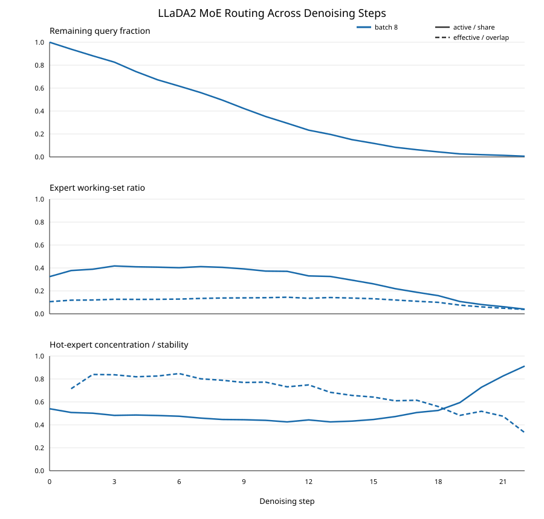

# 大 Batch MoE-dLLM 单 block 去噪过程专家工作集动机实验

> 更新：GSM8K 与 HumanEval batch 16 轨迹及两项离线复核均已完成。最新四组对照、下一步及证据边界以 [统一实验汇总](../../EXPERIMENT_SUMMARY.md) 为准。本文后续保留早期 batch-8 分析；其中“完整轨迹”均指单 block，“排除有限样本”仅指相对于 assignment-level step-0 null 的检验，不是排除所有采样影响。

## 核心内容摘要

### 核心研究问题

FOCUS 通过减少进入后续层的 Query 数量加速 dLLM。本实验进一步研究：

> 对于大 batch MoE-dLLM 中仍需执行的 Query，专家负载是否集中在一个较小且跨 denoising step 稳定的有效工作集上？

如果答案成立，就可以从 expert 维度优化访存、执行与调度，与 FOCUS 的 Query reduction 形成互补。

### 核心实验设置

```text
模型：LLaDA2.0-mini（256 experts/layer，Top-8 routing）
数据：GSM8K test 与 HumanEval test，各 32 prompts
Batch：8，共 4 个 prompt groups
生成：单个 32-token mask block，最多 32 个 denoising steps
统计：19 个可观测 MoE 层；每一步只统计尚未解析的 mask Query
模式：Vanilla HuggingFace，未启用 FOCUS
```

### 核心结果

前中期 step 0–12 中，平均 Query 从 256 下降到 59.75，统计结果为：

| 核心指标 | 结果 | 直接含义 |
|---|---:|---|
| Active experts | 98.64 / 256 | 大量长尾专家会被少量激活 |
| Effective experts | 33.16 / 256 | 主要负载集中在约 30–40 个有效专家 |
| Top-10 load share | 47.18% | 10 个专家承担接近一半的 assignment |
| 相邻 step Top-10 Jaccard | 79.14% | 相邻步平均共享约 8.84/10 个热点专家 |
| 跨 prompt group Top-10 Jaccard | 54.34% | 不同输入组平均共享约 7.04/10 个热点专家 |
| 随机 Top-10 Jaccard | 1.99% | 实际稳定性远高于随机重叠 |
| 上一步排序恢复 Oracle 收益 | 97.36% | 完整专家负载顺序同样具有跨步可预测性 |
| Query-matched null effective experts | 26.69（真实值33.67） | 真实后续路由比单纯减少 Query 的基线更分散 |

需要特别区分：**约 33 个 effective experts 不等于模型只激活 33 个专家**。实际平均 active experts 约为 99，说明路由存在长尾；能够用于方法设计的是负载集中性和热点稳定性，而不是直接裁剪其他专家。

两项无 GPU 的补充验证及完整结果见 [`offline_hypotheses/OFFLINE_HYPOTHESES.md`](./offline_hypotheses/OFFLINE_HYPOTHESES.md)。补充实验表明，30–40 个有效专家不是 Query 减少造成的有限样本假象，但后续路由相对于 step 0 会有所多样化，因此不应将动机表述为“专家负载随去噪不断变得更加集中”。

HumanEval 使用完全相同的 batch、生成长度和统计口径完成了代码任务复现：

| 前中期 step 0–12 | GSM8K | HumanEval |
|---|---:|---:|
| Active experts | 98.64 | 94.86 |
| Effective experts | 33.16 | 37.07 |
| Top-10 load share | 47.18% | 44.89% |
| 相邻 step Top-10 Jaccard | 79.14% | 74.62% |
| 上一步排序恢复 Oracle 收益 | 97.36% | 96.60% |
| Query-matched null effective experts（step 1–12） | 26.69 | 26.42 |

两个任务的绝对集中程度存在差异，但都表现出约 30–40 个有效专家、约 45% 的 Top-10 负载占比以及很强的跨步排序可预测性。这说明信号不是 GSM8K 数学问答特有现象。HumanEval 原始轨迹和派生结果见 [`../../humaneval/bs8/`](../../humaneval/bs8/)。

### 核心结论与论文动机

实验支持两个假设：

1. **有效工作集集中**：物理上激活的专家较多，但主要负载长期集中在约 30–40 个有效专家上。
2. **热点跨步稳定**：同层热点专家在相邻去噪步之间高度重叠，前一步负载排序能够作为下一步的强先验。

可以用于论文的核心动机表述是：

> 大 batch MoE-dLLM 的完整去噪过程存在稳定且高度集中的逐层专家工作集。前一 denoising step 已产生的专家负载排序能够低成本地预测下一步的专家优先级，因此可以在不改变 token-to-expert 路由的前提下，优化专家访存、执行顺序和调度开销。

它与 FOCUS 的关系为：

```text
FOCUS：在 Query 维度减少需要继续计算的 token
本文动机：在 Expert 维度优化剩余 Query 的 MoE 执行
```

### 首选方法方向

首选设计是**跨步专家优先级复用**：每个 MoE 层仅维护上一 denoising step 的专家负载排序，并在下一步按照该排序进行专家权重预取、重负载专家优先提交和 grouped-GEMM 调度准备。

该设计的关键性质是：

- 只复用上一 step 的逐层专家排序，不设计预测网络或多参数打分函数。
- 当前 step 仍执行真实 router 选择的全部专家，不裁剪长尾专家。
- 不改变 token-to-expert assignment，因而原则上保持模型输出和精度不变。
- 主要加速机会来自前中期；后期 Query 极少时收益自然降低，无需额外设计切换阈值。

当前最值得首先验证的二元对照是：

```text
Baseline：原始专家执行顺序
Method：使用上一 denoising step 负载排序的专家执行顺序
```

主要测量端到端吞吐、单步 MoE latency、dispatch/sort 开销、HBM/L2 行为以及 Expert Parallel 通信尾延迟。

### 当前证据边界

当前结果足以支持方法原型，并已在 LLaDA2.0-mini 的 GSM8K 与 HumanEval、batch 8、各 32 个 prompts 上复现。正式形成大 batch 普适结论前仍需补充 GSM8K batch 16 完整轨迹、Vanilla/FOCUS 对照与跨模型实验。后期 Query 很少时出现的 Top-10 share 上升属于有限样本效应，不能作为主要动机证据。

## 1. 实验目标

本实验面向大 batch 条件下的 MoE 型扩散语言模型（MoE-dLLM）推理，研究完整去噪过程中专家负载是否同时具有以下两个性质：

1. **工作集集中性**：虽然一次前向可能激活大量专家，但真正承担主要 token 负载的有效专家是否只有较小的一部分。
2. **跨步稳定性**：同一层的热点专家集合是否会在相邻 denoising step 之间保持稳定。

FOCUS 的加速来源是减少进入后续层的 Query 数量。本实验关注与其互补的问题：在仍需执行的 Query 内部，MoE 专家的执行、访存和调度是否存在可以利用的结构性局部性。

实验不预设复杂的预测函数或多个经验阈值，而是先回答一个直接问题：

> 前一步已经观测到的专家负载次序，能否作为下一去噪步专家执行次序和资源调度的有效先验？

## 2. 实验对象与配置

| 项目 | 配置 |
|---|---|
| 模型 | LLaDA2.0-mini，约 16B 参数 |
| 模型结构 | 20 个隐藏层，其中实际返回路由信息的 MoE 层为 19 层 |
| 专家数量 | 每个 MoE 层 256 个专家 |
| Token 路由 | 每个 Query 选择 Top-8 专家 |
| 数据集 | GSM8K `main/test` |
| Prompt 数量 | 32 |
| Request batch size | 8 |
| Prompt group 数量 | 4 |
| 最大输入长度 | 128 tokens |
| 生成 block 长度 | 32 tokens |
| 最大去噪步数 | 32 |
| 接收策略 | 置信度大于 0.95，或满足当前步最小 transfer quota |
| 解码方式 | Temperature 0，greedy decoding |
| 模型放置 | HuggingFace Accelerate balanced device map，2 张 GPU |
| 实验模式 | Vanilla HuggingFace LLaDA2.0-mini，未启用 FOCUS |

原始与派生结果见：

- [`routes_bs8.jsonl`](./routes_bs8.jsonl)：逐 group、逐 step、逐层的原始专家负载直方图。
- [`moe_denoising_layers.csv`](./moe_denoising_layers.csv)：逐层派生指标。
- [`moe_denoising_summary.csv`](./moe_denoising_summary.csv)：逐 step 汇总指标。
- [`moe_denoising.svg`](./moe_denoising.svg)：Query、专家工作集和热点稳定性曲线。
- [`hf_trace_run.log`](./hf_trace_run.log)：模型加载与运行日志。



## 3. 完整抓取流程

### 3.1 构造大 batch 去噪输入

从 GSM8K 测试集抽取 32 个 prompt，过滤掉超过 128 tokens 的样本，再将它们划分为 4 个互不重叠的 group，每个 group 包含 8 个请求。

对每个 group：

1. 对 prompt 进行左侧 padding，使其能够与固定生成 block 对齐。
2. 在 prompt 后追加一个长度为 32 的全 mask block。
3. 构造 block-causal attention mask：当前生成 block 可以访问完整 prompt，并允许 block 内部双向交互。

初始时每个 group 的未解析 Query 数为：

```text
Q_0 = batch_size × block_length = 8 × 32 = 256
```

### 3.2 每个去噪步的路由抓取

对每个 denoising step，按照以下顺序执行：

1. 在 forward 前识别当前 block 内仍为 mask 的位置，得到每个请求的 `q_seqlens` 和 group 总 Query 数 `Q_t`。
2. 完整执行一次 LLaDA2.0-mini forward，并要求模型返回官方 `output_router_logits`。
3. 对每个 MoE 层，从 router 输出中提取 Top-8 expert IDs。
4. 只保留 forward 开始时仍为 mask 的位置；prompt、padding 和已经解析的 token 均不计入统计。
5. 对每个层、每个专家累计 assignment 数，形成负载向量：

   ```text
   c[t,l,e] = step t、layer l 中路由到 expert e 的 Query assignment 数
   ```

6. 使用 LM head 得到当前 block 的候选 token 和置信度。
7. 独立地为 batch 中每个请求接收高置信度 token；不足时按照当前步最小 quota 接收置信度最高的 token。
8. 更新 mask block，记录 transfer 数量与更新后的剩余 Query 数，再进入下一步。

当一个 group 中不再有 mask token 时停止。虽然最大步数设置为 32，但四个 group 分别在第 22 或第 23 次 forward 后完成，这是高置信度策略一次接收多个 token 的正常结果。

### 3.3 层内统计指标

所有专家指标均在**同一层内部**计算，不跨层合并 expert ID。

#### Active experts

至少接收到一次 assignment 的专家数量：

```text
Active(t,l) = Σ_e 1[c[t,l,e] > 0]
```

该指标反映物理上参与计算的专家集合大小，但只要专家收到一个 token 就会计数，因此容易受到长尾路由影响。

#### Effective experts

使用 inverse Simpson 指标衡量负载意义上的有效专家数量：

```text
Effective(t,l) = (Σ_e c[t,l,e])² / Σ_e c[t,l,e]²
```

如果所有负载均匀分配给 `N` 个专家，该指标等于 `N`；如果少数专家承担大部分负载，该指标会远小于 active experts。该定义不需要额外的负载阈值。

#### Top-10 load share

将专家按负载降序排列，计算前 10 个专家承担的 assignment 比例：

```text
Top10Share(t,l) = Top-10 experts 的 assignment 数 / 全部 assignment 数
```

#### 相邻步 Top-10 overlap

对同一个 group、同一层的相邻去噪步计算 Top-10 集合的 Jaccard overlap：

```text
J(t,l) = |H(t-1,l) ∩ H(t,l)| / |H(t-1,l) ∪ H(t,l)|
```

其中 `H(t,l)` 是 step `t`、layer `l` 的 Top-10 热点专家集合。

在 256 个专家中随机选择两个 Top-10 集合，其解析期望 Jaccard 仅约为：

```text
10 / (2 × 256 - 10) = 1.99%
```

### 3.4 Query 数作为必要控制变量

随着去噪推进，`Q_t` 会自然下降。当 Query 很少时，active experts 必然下降，Top-10 share 也会机械性上升。因此实验始终同时记录：

- `query_tokens`：当前 group 中尚未解析的 Query 数量。
- `query_fraction`：相对于初始 256 个 Query 的比例。

后期少 Query 阶段只用于展示完整轨迹，不作为专家集中性和稳定性的主要证据。

## 4. 实验预期与判定逻辑

### 4.1 若两个假设成立

预期观察到：

- active experts 较多，但 effective experts 明显更少，且在主要生成阶段形成平台。
- Top-10 专家承担显著比例的负载。
- 相邻 step 的同层 Top-10 overlap 远高于随机基线。
- 不同 prompt group 之间仍存在一定的共同热点专家。

这意味着 MoE-dLLM 除了 Query 冗余，还存在可利用的**跨去噪步专家时间局部性**与**专家负载集中性**。

### 4.2 若工作集集中但不稳定

只能说明每一步都有热点专家，但热点身份快速变化。此时静态驻留和前一步预测不可靠，方法应转向 step-aware 的即时调度。

### 4.3 若工作集既不集中也不稳定

专家侧优化缺少足够结构性依据，研究重点应回到 Query reduction、MoE kernel 本身或通信优化，而不应构造热点专家方法。

## 5. 实际运行结果

### 5.1 Query 轨迹

每个 group 从 256 个 Query 开始。由于高置信度 token 会被提前接收，四个 group 在 22–23 次 forward 内全部完成，而不是强制执行满 32 次。

汇总轨迹中的部分代表点如下：

| Step | 平均 Query | Active experts | Effective experts | Top-10 share | 相邻 Top-10 overlap |
|---:|---:|---:|---:|---:|---:|
| 0 | 256.00 | 83.04 | 27.05 | 54.05% | — |
| 1 | 240.50 | 96.66 | 30.39 | 50.79% | 71.52% |
| 3 | 211.50 | 106.79 | 32.45 | 48.27% | 83.68% |
| 6 | 158.00 | 102.91 | 32.87 | 47.50% | 84.72% |
| 9 | 108.00 | 100.28 | 35.62 | 44.45% | 76.94% |
| 11 | 75.25 | 94.82 | 37.09 | 42.58% | 73.14% |
| 12 | 59.75 | 84.64 | 34.63 | 44.31% | 74.84% |
| 16 | 21.50 | 56.13 | 30.92 | 47.23% | 60.98% |
| 20 | 5.00 | 20.78 | 15.44 | 72.78% | 51.83% |
| 22 | 1.50 | 10.39 | 9.81 | 91.28% | 33.26% |

### 5.2 前中期专家工作集统计

在 step 0–12，平均 Query 从 256 下降至 59.75，仍有足够 assignment 支持专家分布统计。该阶段跨 step 的平均结果为：

| 指标 | 实际结果 |
|---|---:|
| 平均 active experts | 98.64 / 256（38.53%） |
| 平均 effective experts | 33.16 / 256（12.95%） |
| 平均 Top-10 load share | 47.18% |
| step 1–12 平均相邻 Top-10 Jaccard | 79.14% |
| 随机 Top-10 Jaccard 基线 | 1.99% |

相邻步 79.14% 的 Jaccard 大致对应两个 Top-10 集合平均共享 8.84 个专家。也就是说，前一步的热点列表通常能够覆盖下一步约 9 个 Top-10 专家。

### 5.3 集中性：active 很大，但 effective 很小

主要阶段平均有约 99 个专家至少收到一次 assignment，但 inverse-Simpson effective experts 只有约 33 个。两者之间接近 3 倍的差距说明：

> LLaDA2.0-mini 的路由具有明显长尾。大量专家会偶尔参与计算，但真正承载主要负载的有效专家工作集只占全部 256 个专家的约 13%。

因此不能将结论表述为“模型只使用了 30–40 个专家”。准确的表述是：

> 模型物理上激活了较多专家，但专家负载高度集中，其有效工作集长期维持在约 30–40 个专家。

### 5.4 时间稳定性：相邻去噪步共享大部分热点专家

step 2–8 的相邻 Top-10 Jaccard 为 78.88%–84.72%，step 9–12 仍保持在 73.14%–77.29%。这些结果远高于 1.99% 的随机基线。

这说明热点专家并不是每一步重新随机出现，而是具有显著的跨 step 时间局部性：

> 同层前一步的专家负载排序，是下一步专家负载排序的强先验。

### 5.5 跨 prompt group 稳定性

在 step 0–12，对相同 layer、相同 step 下的 4 个 prompt group 两两计算 Top-10 Jaccard，得到平均值 54.34%，约对应平均共享 7.04 个 Top-10 专家。

该结果同样显著高于随机基线，但低于相邻 step 的 79.14%。这表明专家热点同时包含两部分：

1. 跨输入普遍存在的全局热点。
2. 当前 batch 内容相关、但能在相邻 step 延续的局部热点。

因此，完全静态的全局热点表不如“全局先验 + 前一步在线观测”准确；对于当前动机，前一步在线观测是更直接且更强的信号。

### 5.6 层间差异

step 0–12 内，不同层的平均 effective experts 约在 17.11–49.24 之间，平均 Top-10 share 约在 34.29%–70.69% 之间；但所有层的平均相邻 Top-10 Jaccard 均保持在约 70.41%–86.17%。

这说明：

- 专家集中程度具有明显层间差异，不宜用一个全局负载阈值裁剪所有层。
- 时间稳定性在不同层中较普遍，使用每层自身的前一步排序比构造统一热点集合更合理。

### 5.7 后期数据的有限样本效应

step 19 后平均 Query 已不足 7。此时 Top-10 share 从 59.44% 上升到 91.28%，active/effective experts 同时快速下降。这主要是 assignment 数量太少造成的机械现象，不能解释为后期专家集中性突然增强。

因此本文动机应建立在前中期的稳定结果上，后期数据只说明：当 Query 接近耗尽时，专家侧优化的绝对收益也会自然减小。

### 5.8 HumanEval 跨任务复现

HumanEval 同样使用 32 个 prompts、batch 8、32-token mask block、最多 32 个 denoising steps、0.95 置信度和 greedy decoding。四个 group 的完整轨迹见 [`../../humaneval/bs8/routes_bs8.jsonl`](../../humaneval/bs8/routes_bs8.jsonl)，汇总结果见 [`../../humaneval/bs8/moe_denoising_summary.csv`](../../humaneval/bs8/moe_denoising_summary.csv)。

在 step 0–12，HumanEval 平均激活 94.86 个专家，但 effective experts 仅为 37.07，Top-10 承担 44.89% 的 assignment；step 1–12 的相邻 Top-10 Jaccard 为 74.62%，远高于 1.99% 的随机基线。相较 GSM8K，HumanEval 的负载略微更分散、热点重叠略低，但现象的量级和方向一致。

两项无 GPU 验证也在 HumanEval 上成立：

- 上一 step 完整专家排序恢复 96.60% 的 Oracle 排序收益，lag 8 时仍恢复 87.66%。
- Query-matched null 在 step 1–12 的 effective experts 为 26.42，而真实值为 37.92；真实 Top-10 share 为 44.01%，null 为 55.75%。
- 真实路由相较 step-0 下采样更加分散，但其完整排序仍高度可预测，与 GSM8K 的结论一致。

派生数据和图见 [`../../humaneval/bs8/offline_hypotheses/`](../../humaneval/bs8/offline_hypotheses/)。跨任务结果支持“复用前一步逐层专家排序”，但不支持用固定专家集合进行静态裁剪。

## 6. 实验结论与研究动机

GSM8K 与 HumanEval 的完整轨迹共同支持两个初始假设：

1. **有效工作集集中**：两个任务主要阶段平均激活约 95–99 个专家，但有效专家仅约 33–37 个，Top-10 承担约 45%–47% 的负载。
2. **热点集合稳定**：相邻 step 的同层 Top-10 Jaccard 平均约 75%–79%，显著高于 1.99% 的随机基线；GSM8K 不同 prompt group 间也有约 54% 的重叠。

由此形成的核心研究动机是：

> 大 batch MoE-dLLM 的去噪过程不仅存在 Query 数量随生成推进而变化的特征，还存在稳定、集中的逐层专家工作集。前一 denoising step 已产生的专家负载排序可以低成本地预测下一步的专家优先级，从而减少专家访存、调度和执行中的低效开销。

这一动机与 FOCUS 的关系是互补的：

- FOCUS 在 token/Query 维度减少不必要的计算。
- 本实验揭示的机会在 expert 维度优化剩余 Query 的执行顺序和数据移动。
- FOCUS 减少 Query 后，专家集中性可能增强，也可能因样本减少而变得不稳定，需要单独进行 Vanilla/FOCUS 对照，不能直接从本实验推断。

## 7. 基于动机的方法设计

### 7.1 首选方法：跨步专家优先级复用

最直接的方法是不预测每个 token 的具体路由，也不改变 router，而是复用上一去噪步的逐层专家负载排序。

对每个 MoE 层 `l`，维护上一 step 的专家顺序：

```text
R[t-1,l] = experts 按照 c[t-1,l,e] 从高到低排列
```

在 step `t`：

1. Attention 和 gating 计算期间，按照 `R[t-1,l]` 的顺序准备专家描述符、预取权重 tile 或安排通信。
2. Router 输出当前真实 assignment 后，仍按照该顺序优先启动预计负载较重的专家；当前没有 token 的专家直接跳过。
3. 当前 step 完成后，用实际负载生成新的 `R[t,l]`，供下一步使用。

该设计只有一个核心状态——上一 step 的专家排序，不需要置信度阈值、预测网络或多参数打分函数。它不改变 token-to-expert 路由和专家输出，因此理论上不会造成模型精度损失。

### 7.2 可落地的系统优化位置

#### 专家权重按序预取

相邻 step 平均约有 8.84/10 个热点专家相同，可以在当前层 Attention 计算期间，按照上一 step 排序提前触发热点专家权重的数据移动。能够预取多少由硬件可用缓存或显存空间自然决定，而不是再引入一个算法阈值。

适合优化的目标包括：

- HBM 到片上缓存的数据局部性。
- Expert Parallel 场景中的跨卡权重或 token 通信准备。
- 分层加载或专家卸载场景中的 CPU/NVMe 到 GPU 预取。

#### 重负载专家优先执行

Top-10 专家承担约 47% 的 assignment。将上一 step 中负载较重的专家优先提交，可以让长任务更早开始，降低并行执行末端由重专家造成的 straggler latency。

该方法执行的仍是当前 router 给出的全部专家，不进行专家裁剪。

#### 专家 kernel 计划复用

上一 step 的专家负载不仅提供排序，也提供每个专家的大致 token 数。可以复用上一 step 对应的 grouped-GEMM 分组顺序、workspace 布局和 kernel 执行计划，在当前真实计数得到后只修正长度，而不重新完成全部调度构造。

#### Expert Parallel 热点复制或放置

跨 prompt group 的 Top-10 Jaccard 为 54.34%，说明部分热点具有输入无关性。在 Expert Parallel 系统中，可以根据 warm-up 得到的逐层长期负载顺序，优先复制或就近放置高频专家，缓解热点专家所在设备的通信与负载压力。

这一方向比跨步优先级复用更依赖具体部署架构，适合作为扩展方法，而不是当前工作的第一实现。

### 7.3 不建议直接采用的方法

#### 不应直接只执行 30–40 个专家

Effective experts 约为 33 不代表其余专家没有 token。主要阶段 active experts 仍约为 99，直接裁剪长尾专家会改变模型输出，必须进行额外训练或精度补偿，不能由本实验直接支持。

#### 不应构造跨层统一热点集合

Expert ID 只在层内有意义，并且各层集中程度差异明显。方法必须维护逐层排序，不能将不同层的相同编号视为同一个专家。

#### 不应主要依赖后期 Top-10 share

后期 70%–90% 的 Top-10 share 由极少 Query 导致，此时专家侧优化的绝对计算量已经很小。方法收益应主要来自前中期，而不是专门设计后期切换规则。

## 8. 方法验证建议

实现首选的“跨步专家优先级复用”后，建议保持方法本身简单，仅做以下二元对照：

1. Vanilla 原始专家执行顺序。
2. 使用上一 step 负载排序的专家执行顺序。

主要系统指标：

- 端到端 generation latency 和吞吐量。
- 每个 denoising step 的 MoE latency。
- 专家 dispatch/sort 开销。
- HBM 读取量与 L2 cache hit rate。
- Expert Parallel 场景下的通信量、设备负载和尾延迟。

正确性指标：

- Router assignment 与原始执行逐项一致。
- 输出 token 与原始执行一致。
- 数据集准确率不下降。

为了判断动机的普适性，还需要保持同一统计口径补充：

- GSM8K batch 16：验证更大 batch 下的工作集与稳定性。
- HumanEval batch 8 已完成；可选补充 MBPP，但不再是当前优先项。
- FOCUS batch 8：与本次 Vanilla 轨迹进行直接对照。

## 9. 当前结论的适用边界

当前结果来自 LLaDA2.0-mini、GSM8K 与 HumanEval、batch 8 和每个任务 32 个 prompt，足以支持方法原型和初步跨任务结论，但尚不足以声称所有 batch 规模或所有 MoE-dLLM 均具有相同规律。

目前可以可靠声称：

> 在 LLaDA2.0-mini 的数学推理与代码生成任务中，大 batch 完整去噪过程的专家负载均表现出显著的有效工作集集中性和跨 step 时间稳定性；上一 step 的逐层负载排序能够近似下一 step 的 Oracle 顺序。

在完成 batch 16、FOCUS 对照和跨模型验证前，不应声称：

- 稳定工作集大小固定为某个模型无关常数。
- 所有任务共享完全相同的热点专家。
- 该现象已经能够直接带来端到端加速。
- 可以在不做精度验证的情况下裁剪长尾专家。

## 10. 后续实验状态与优先级

| 顺序 | 实验 | 当前状态 | 说明 |
|---:|---|---|---|
| 1 | 完整排序跨步预测 | 已完成 | GSM8K 与 HumanEval 均显示上一 step 排序可恢复约 97% 的 Oracle 收益。 |
| 2 | Query 数量 null baseline | 已完成 | 两个任务均排除了“仅由 Query 减少造成有效专家较少”的解释。 |
| 3 | GSM8K batch 16 单 block 完整轨迹 | 已完成 | GSM8K 与 HumanEval batch 16 原始轨迹及两项离线复核均已完成。 |
| 4 | 单层专家 replay | 待完成 | 判断排序可预测性是否能转化为真实 MoE latency 收益。 |
| 5 | HumanEval 完整轨迹 | 已完成 | 已验证代码任务上的跨任务一致性；MBPP 降为可选补充。 |
| 6 | Vanilla/FOCUS 对照 | 待完成 | 判断 Query reduction 与专家时间局部性的关系。 |
| 7 | SDAR-30B | 待完成 | 验证跨模型泛化。 |
| 8 | Expert Parallel | 待完成 | 面向多卡专家并行中的通信与尾延迟。 |

当前下一项是 **单层专家 replay**，验证路由排序结构能否转化为实际执行收益；随后补充多 block 轨迹。最新结果与方法限制见统一实验汇总。
