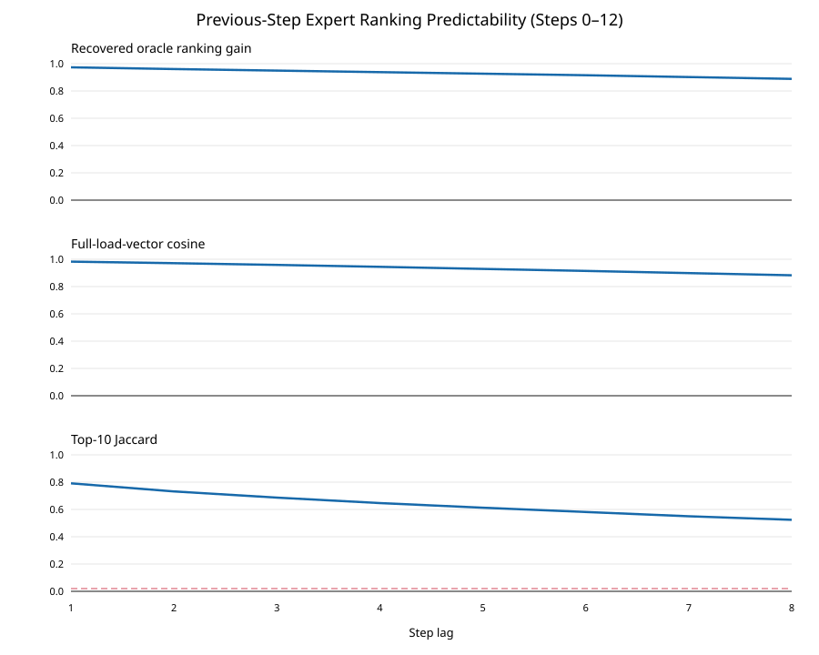
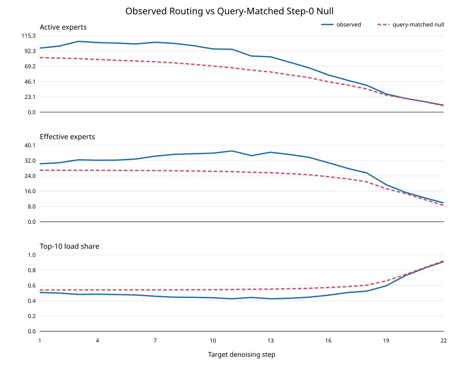

# MoE 路由离线假设验证

本报告直接使用 [`routes_bs8.jsonl`](../routes_bs8.jsonl)，不重新加载模型，也不需要 GPU。分析对象仍是 LLaDA2.0-mini、GSM8K、batch 8 的完整去噪轨迹。

## 1. 实验一：上一 Step 排序能否预测下一 Step

### 研究问题

已有实验显示相邻 step 的 Top-10 专家集合高度重叠，但“跨步专家优先级复用”需要更强的证据：上一 step 的**完整专家负载排序**是否接近当前 step 的真实最优排序。

对当前 step 的真实专家负载，分别使用三种顺序计算累计负载覆盖曲线：

1. **Oracle**：按当前 step 的真实负载降序排列。
2. **Previous-step**：按之前 step 的负载降序排列。
3. **Random**：随机排序的解析期望。

将累计覆盖曲线在全部 256 个专家上的面积记为 ranking AUC，并计算 Previous-step 相对于 Random 恢复了多少 Oracle 排序收益：

```text
RecoveredGain = (AUC_previous - AUC_random) / (AUC_oracle - AUC_random)
```

该指标使用完整排序，不需要选择 Top-K 或负载阈值。

### 主要结果

前中期 step 0–12 的结果如下：

| Step lag | Oracle收益恢复率 | 完整负载余弦相似度 | Top-10 Jaccard | 旧Top-10覆盖当前负载 |
|---:|---:|---:|---:|---:|
| 1 | 97.36% | 98.28% | 79.14% | 45.84% |
| 2 | 96.10% | 97.10% | 73.19% | 44.88% |
| 3 | 94.96% | 95.85% | 68.64% | 43.88% |
| 4 | 93.82% | 94.44% | 64.64% | 42.95% |
| 5 | 92.69% | 92.95% | 61.28% | 41.91% |
| 6 | 91.50% | 91.48% | 58.15% | 40.92% |
| 7 | 90.17% | 89.88% | 55.01% | 39.75% |
| 8 | 88.84% | 88.28% | 52.38% | 38.78% |

相邻 step 中：

```text
Oracle ranking AUC       = 0.9256
Previous-step ranking AUC = 0.9145
Random ranking AUC        = 0.5020
```

上一 step 排序与当前 Oracle 排序的 AUC 差距只有约 0.0112，并恢复了 97.36% 的可恢复排序收益。即使相隔 8 个 step，恢复率仍为 88.84%。

### 结论

> 专家时间局部性不只存在于 Top-10 集合，而是覆盖完整负载排序。上一 denoising step 的逐层专家顺序几乎复现了当前 step 的 Oracle load-first 顺序。

该结果直接支持“跨步专家优先级复用”，并说明方法不必设计负载预测网络或多参数打分函数。每层保存上一 step 的实际负载顺序即可。



详细数据：

- [`temporal_predictability_pairs.csv`](./temporal_predictability_pairs.csv)
- [`temporal_predictability_summary.csv`](./temporal_predictability_summary.csv)

## 2. 实验二：Query 数量匹配的 Step-0 Null Baseline

### 研究问题

随着去噪进行，Query 数自然减少。需要排除以下替代解释：

> 后续 step 的 active/effective experts 和 Top-10 share 变化，是否仅仅是从 step 0 分布中抽取更少 assignment 导致的有限样本现象？

对每个 group 和 layer，以其 step 0 专家负载直方图作为固定总体，再无放回抽取与目标 step 完全相同数量的 assignment。每个目标重复 256 次，形成 Query-matched null distribution。然后将目标 step 的真实指标与 null 均值和 95% 区间比较。

该 baseline 保持 step 0 的专家概率结构，只改变 assignment 数量。它是 assignment-level 近似，不建模同一 Query 的 Top-8 专家之间的相关性。

### 前中期结果

step 1–12 的平均结果为：

| 指标 | 真实路由 | Query-matched null | 真实值减 Null |
|---|---:|---:|---:|
| Active experts | 99.94 | 75.17 | +24.77 |
| Effective experts | 33.67 | 26.69 | +6.98 |
| Top-10 load share | 46.61% | 54.36% | -7.75 个百分点 |

层/step 观测落在各自 null 95% 区间之外的比例为：

| 指标 | 超出 Null 95% 区间的观测比例 |
|---|---:|
| Active experts | 97.92% |
| Effective experts | 91.12% |
| Top-10 load share | 91.01% |

### 结论

真实的后续路由相比“对 step 0 分布简单下采样”表现得更分散：激活和有效专家更多，Top-10 占比更低。因此：

1. 主要阶段约 30–40 个 effective experts 的现象不是 Query 变少制造的有限样本假象。
2. 去噪推进并没有让专家分布相对于 step 0 持续变得更集中；它在保持明显非均匀性的同时有所多样化。
3. 极后期 Top-10 share 上升到 70%–90% 才主要是 Query 过少造成的机械性上升，不能作为方法动机。

所以论文中更准确的表述应当是：

> 在前中期去噪过程中，专家负载始终具有远小于全部256个专家的有效工作集；该工作集随 step 发生一定多样化，但其负载排序仍具有极强的时间连续性。

而不应表述为：

> 专家负载会随着去噪推进不断变得更加集中。



详细数据：

- [`query_matched_null_layers.csv`](./query_matched_null_layers.csv)
- [`query_matched_null_summary.csv`](./query_matched_null_summary.csv)

## 3. 对方法方向的综合判断

两项离线实验共同给出的判断是：

- **支持排序复用**：相邻 step 的完整专家负载顺序接近 Oracle，信号强且无需额外预测器。
- **不支持静态裁剪**：后续路由会比 step 0 更分散，并且仍有大量长尾专家被真实激活。
- **不支持“越往后越集中”的阶段切换规则**：后期集中度上升主要由 Query 耗尽造成。
- **最合适的方法对象是执行顺序和数据移动**：复用上一 step 排序进行预取、load-first 提交或 kernel plan 准备，同时保持当前 router 的全部真实 assignment。

因此，下一项需要 GPU 的关键实验不应马上实现完整系统，而应先做一个单层真实负载 replay：保持专家和 token 完全相同，只比较默认执行顺序、上一 step 顺序和当前 Oracle 顺序的 MoE latency。该实验将判断强排序可预测性是否能够转化为实际硬件收益。
